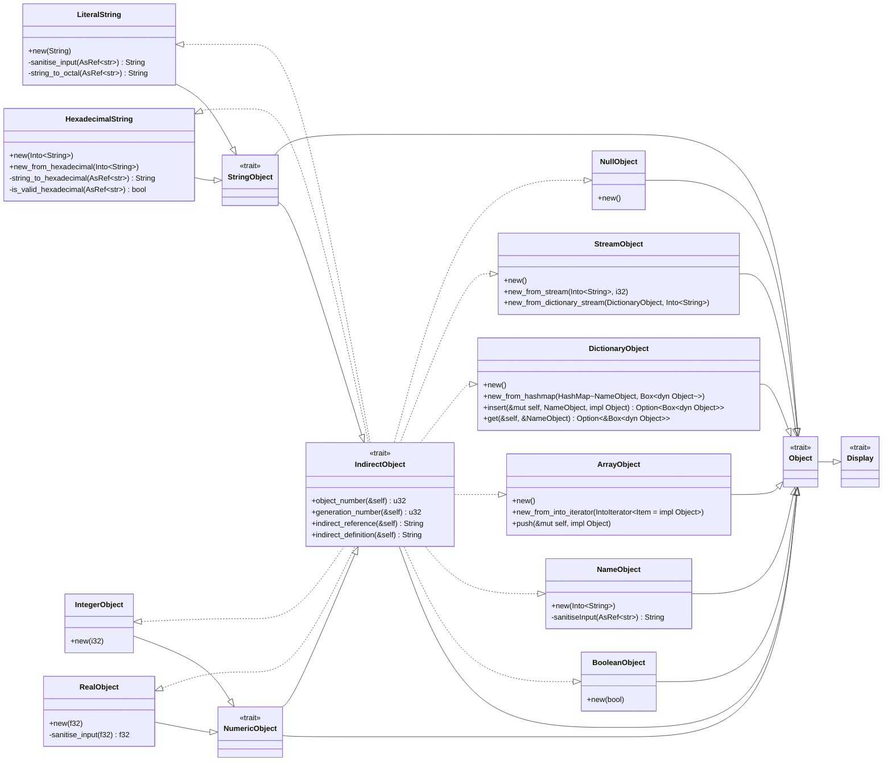

# PDF Basic Objects UML Class Diagram

The dashed lines in the UML diagram below represent implementations (i.e., `impl SourceTrait for TargetStruct`) while the solid lines represent inheritance (i.e., `impl TargetTrait for SourceStruct` or `trait SourceTrait : TargetTrait`).

The `Object` trait is an umbrella trait for all basic PDF objects and represents a **direct object**.
Every basic object implements this trait.
Every basic object can be indirectly referenced as they implement the `IndirectObject` trait.
`IndirectObject` implementors contain `object_number` and `generation_number` struct fields; the usage of the indirect reference is not guaranteed.

All `new()` constructors should have an `global_object_number_counter` parameter so that testing becomes possible (directly using the atomic counter defined in `lib.rs` in the struct instantiation, as done before, required all object tests to run in a specific order; passing the counter as a parameter allows for an atomic counter to be defined per test module, circumventing the need of a specific test order).

## Display Trait Implementation

The implementation of the `Display` trait is defined in the respective subsections of the objects.
